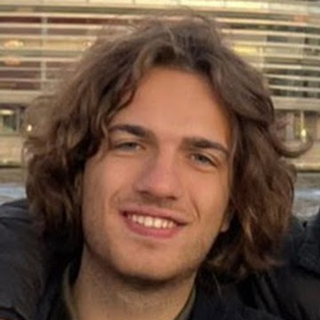
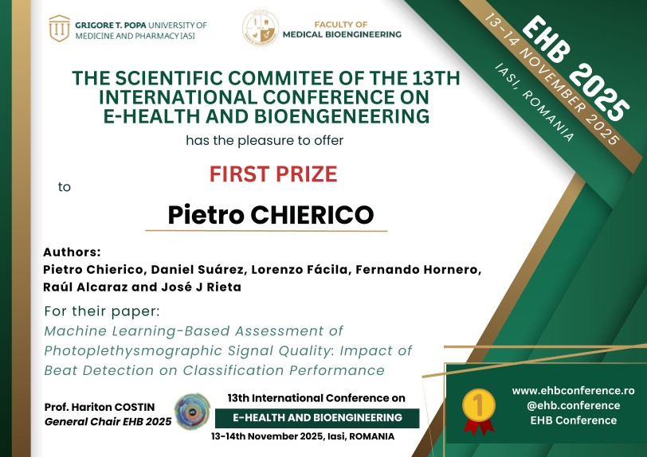

::: {.columns .items-center}

::: {.column width="30%"}

{width=60% .rounded-circle}

:::

::: {.column width="70%"}

## About me

I am a PhD student in Biomedical Engineering at Universitat Politècnica de València, affiliated with BioMIT.org, and a visiting researcher at Khalifa University.

My research focuses on digital health, physiological signal processing, wearable sensing, photoplethysmography, cardiovascular monitoring, and AI-driven biomedical technologies.

I am interested in developing reliable and reproducible methods for biomedical signal analysis, with applications in wearable and translational healthcare engineering.

### Research interests

- Digital health
- Physiological signal processing
- Wearable sensing
- Photoplethysmography
- Cardiovascular monitoring
- Biomedical AI
- Reproducible research

### Links

- [ResearchGate](https://www.researchgate.net/profile/Pietro-Chierico-3)
- [ORCID](https://orcid.org/0009-0006-9076-8532)
- [LinkedIn](https://www.linkedin.com/in/pietro-chierico-a94023193/)
- [GitHub](https://github.com/PietroChierico)

:::

:::
---

## Awards

### First Prize — EHB 2025 International Conference

**13th International Conference on E-Health and Bioengineering (EHB 2025), Iași, Romania**

Awarded for the paper:

*Machine Learning-Based Assessment of Photoplethysmographic Signal Quality: Impact of Beat Detection on Classification Performance.*

{width=70%}